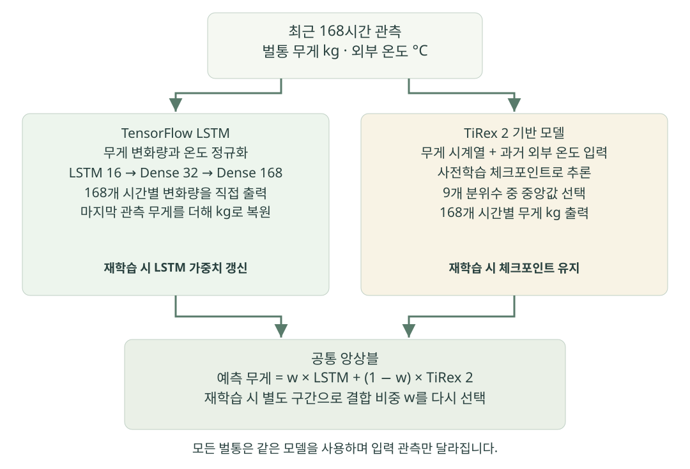
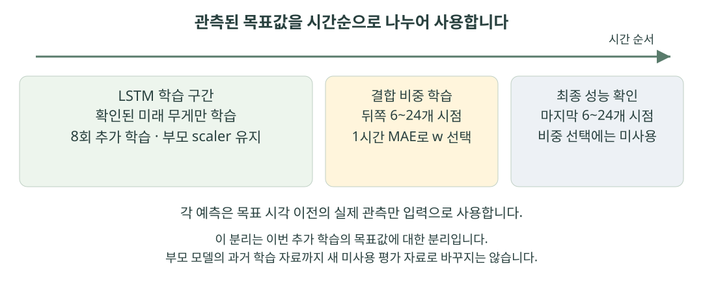

# BeeOPS 모델 상세 설명

**독립 실행 최종본 · 현재 구현 기준 2026-10-01**  
대상: 모델의 기본 개념을 아는 개발자·발표자·평가자  
초기 모델 스냅샷: 번들 9 · 새 실행의 적용 모델은 API에서 확인  
관련 문서: [BeeOPS 조별 기획서](BeeOPS_조별기획서.md)

BeeOPS는 **한 벌통의 최근 168시간 무게·외부 온도로 앞으로 168시간의 무게를 예측하는 공통 앙상블**을 사용한다. 작은 LSTM과 사전학습된 TiRex-2가 각각 예측한 kg 값을 가중평균한다. 현재 재학습 코드는 LSTM의 신경망 파라미터와 두 모델의 결합 비율을 학습하며, TiRex-2 체크포인트는 고정한다.

이 문서는 실행 코드, 저장된 모델, 실제 API 상태, 격리된 재학습 검증 결과를 기준으로 작성했다. 논문의 모델 설명, 서비스가 실제로 사용하는 기능, 이번 프로젝트에서 측정한 결과를 구분한다.

## 1. 최종본에 포함된 모델과 실행 중 모델

**독립 폴더의 초기 모델은 번들 9이며, LSTM 45% + TiRex-2 55%다.** `registry_id`는 `BeeOPS_Horizon_Weight`, `run_id`는 `d3a7d6beca674cab8037bb9f51f99c78`다. 포함된 인덱스와 manifest에서 확인할 수 있다. 원래 개발 서버의 관측·작업 원장은 복사하지 않으며, 최종본을 시작하면 세 공개 관측 사례를 독립 원장에 등록한다.

| 구분 | 초기 포함 값 | 확인 방법 |
|---|---|---|
| 공통 번들 | 9 | `data/horizon_models/index.json` |
| 구성·결합 비중 | LSTM 0.45 / TiRex-2 0.55 | `data/horizon_models/9/manifest.json`의 `weights` |
| 입력·최대 출력 | 각각 168시간 | 같은 manifest의 `context_hours`, `max_horizon_hours` |
| 최근 학습 방식 | 고정 합성 관측을 재사용한 실제 LSTM·결합 비율 학습 | `temperature_training.practice_replay` |
| 새 학습 결과 | 이 폴더에 새로운 번들로 등록·적용 | 모델 화면, `GET /models/horizon` |

아래의 신경망 구조와 전처리 설명은 포함 모델에서 확인한 내용이다. **번들 9의 평가에는 이미 사용한 합성 실습 자료가 포함되므로 독립적인 현장 성능 결과가 아니다.** 13절의 초기 번들 2 장기 벤치마크도 별도 과거 비교이며 현재 모델의 재측정치로 쓰지 않는다.

저장소를 내려받은 `BeeOPS_최종본` 안에서 `docker compose up --build`로 실행한다. 기본 주소는 `http://localhost:8012`다. macOS 직접 실행은 `sh setup.sh` 후 `sh start.sh`를 사용한다. 이후 재학습으로 번호와 비중이 달라질 수 있으므로 화면의 활성 모델·run ID를 최종 기준으로 삼는다.

근거: [포함 인덱스](../data/horizon_models/index.json), [초기 9번 manifest](../data/horizon_models/9/manifest.json), [9번 평가](../data/horizon_models/9/evaluation.json), [온도 실습 안내](온도_드리프트_실습.md).

## 2. 무엇을 예측하며, 어떤 데이터를 사용하는가

예측 대상은 **시간별 벌통 전체 무게(kg)**다. 벌통·벌·꿀·저장물 등이 함께 반영된 센서 무게이며, 벌꿀만의 생산량이나 채밀 가능량을 직접 예측하는 모델은 아니다. 외부 온도는 무게 변화에 도움이 될 수 있는 관측 변수로 사용한다. 온도와 무게의 관계를 학습했다는 사실이 생물학적 인과관계를 입증하지는 않는다.

| 입력 필드 | 의미 | 신경망에 수치로 전달되는가 |
|---|---|---|
| `timestamp` | 해당 시간 관측의 기준 시각 | 시간 간격·예측 대상 정렬에 사용. 현재 두 모델 입력에 별도 달력 특성으로 넣지 않음 |
| `hive_id` | 벌통 식별자 | 다른 벌통이 섞이지 않게 검사. ID 임베딩은 사용하지 않음 |
| `weight_kg` | 시간별 무게 | 예 |
| `temperature_c` | 외부 주변 온도 | 예 |
| `event` | normal 또는 관리·이상 사건 표시 | 재학습 구간을 고르는 데 사용. 별도 입력 채널은 아님 |

기본 대시보드에는 다음 세 개의 공개 실측 CSV를 등록한다. 사용자가 추가한 벌통은 별도 작업공간으로 보존한다.

| 공개 관측 사례 | 시간별 행 수 | 기록 기간 |
|---|---:|---|
| 브라질 Apis 2 | 609 | 2024-12-18 15:00 ~ 2025-01-12 23:00 |
| Vecauce 3 | 456 | 2021-07-13 00:00 ~ 2021-07-31 23:00 |
| 브라질 무침벌 1 | 477 | 2025-10-29 00:00 ~ 2025-11-17 20:00 |

공개 원자료는 공동으로 유효한 무게·외부 온도 관측을 시간 구간별 중앙값으로 집계한다. `[h, h+1)`의 관측을 완료 시각 `h+1`에 표시한다. 무게 오프셋이나 인위적인 추세를 추가하지 않으며, 빈 시간대를 보간하지 않는다. CSV 사례는 관측 추세를 확인한 뒤 고른 구간이므로 무작위 표본이나 독립적인 성능 시험 표본으로 취급하지 않는다.

원자료의 시간대는 확인되지 않았다. 공개 사례의 `+00:00`은 시각을 일관되게 저장하기 위한 표기이며, 실제 현지 시각을 검증하여 UTC로 변환했다는 뜻이 아니다. 따라서 이 시각으로 현지 낮·밤이나 벌의 활동 원인을 단정할 수 없다. `normal`도 현장 개입이 없었다는 인증이 아니라, 제공된 수치·사건 규칙에 따른 표시다.

근거: [관측 사례 manifest](../data/trend_cases/manifest.json), [horizon_data.py](../app/horizon_data.py)의 `canonical_real_rows`, `load_real_sources`, [dashboard_data.py](../app/dashboard_data.py)의 `seed`.

## 3. 168×2 입력과 168개 출력의 정확한 의미



예측 기준 시각을 `t`라고 하면 입력은 `t-167`부터 `t`까지 **동일 벌통의 연속된 168개 시간 관측**이다. 한 행의 순서는 `[무게, 외부 온도]`다.

```text
X = [[weight[t-167], temperature[t-167]],
     ...,
     [weight[t],     temperature[t]]]       shape: (168, 2)

여러 입력을 한 번에 처리할 때                 shape: (N, 168, 2)
모델의 7일 예측                              shape: (N, 168)
각 출력의 대상                              t+1, t+2, ..., t+168
```

여기서 `N`은 입력 구간의 개수다. 여러 벌통을 묶어 처리해도 각 구간의 시계열은 따로 입력된다. 공통 모델이라는 말은 같은 파라미터와 결합 비율을 쓴다는 뜻이지, 여러 벌통의 무게를 이어 붙여 하나의 벌통처럼 예측한다는 뜻이 아니다.

서빙은 1·24·72·168시간 요청을 지원한다. 대시보드의 미래 예측은 168개 시간값을 사용한다. LSTM은 항상 168개의 출력을 한 번에 만든다. TiRex-2의 요청 길이는 사용 경로에 따라 다르다. 미래 궤적 경로는 168시간을 생성하고 필요한 길이를 취하며, 과거 비교·결합 비율 학습은 실제 1시간 요청으로 계산한다. **TiRex-2의 1시간 요청 결과가 168시간 요청의 첫 값과 반드시 같다고 가정하지 않는다.**

168행이 부족하거나 한 벌통의 연속된 시간 간격을 만족하지 못하면 정상적인 미래 궤적을 만들지 않는다. 추론 과정의 누락된 모델을 임의의 직선이나 persistence로 대체하지도 않는다.

근거: [horizon_models.py](../app/horizon_models.py)의 `predict`, `predict_batch`, `_predict_component_batch`.

## 4. LSTM 입력 정규화와 kg 복원

LSTM에 원래의 kg·섭씨 값을 그대로 넣지 않는다. 각 입력 구간의 마지막 무게를 기준으로 무게를 상대화하고, 저장된 학습 scaler로 크기를 조정한다. Scaler는 수치의 범위를 맞추기 위한 변환 계수다.

```text
w0 = 입력 구간의 마지막 관측 무게

정규화된 무게[i] = (weight[i] - w0) / weight_scale
정규화된 온도[i] = (temperature[i] - temperature_mean) / temperature_scale

LSTM 출력 delta[h]의 학습 정답 = (실제 weight[t+h] - w0) / weight_scale
LSTM의 kg 예측[h] = w0 + delta[h] * weight_scale
```

포함 번들 9에 저장된 값은 다음과 같다. 새 재학습도 부모 번들의 scaler를 유지한다.

| 계수 | 저장된 값 |
|---|---:|
| `weight_scale` | 2.9984389027515608 kg |
| `temperature_mean` | 28.16724689171857 °C |
| `temperature_scale` | 3.481366552194797 °C |

기본 scaler 학습 함수는 학습 입력의 마지막 무게 대비 상대값 표준편차와 온도의 평균·표준편차를 계산하며, 분모가 너무 작아지지 않도록 하한을 둔다. 서빙 중 요청마다 전체 scaler를 다시 학습하지 않는다. 입력 구간의 마지막 무게 `w0`만 해당 요청에서 새로 정한다.

이 설계는 절대 무게가 다른 벌통 사이에서도 변화 형태를 공유하기 위한 것이다. 다만 무게의 절대 수준이 필요한 효과는 상대화 과정에서 약해질 수 있다. 이를 보완하는 최적 입력 설계를 별도로 입증한 실험은 아니다.

근거: [horizon_data.py](../app/horizon_data.py)의 `fit_scaler`, `encode_context`, [9번 manifest의 scaler](../data/horizon_models/9/manifest.json).

## 5. LSTM은 실제로 어떤 신경망인가

운영 `lstm.keras`를 직접 로드해 확인한 구조는 다음과 같다. 입력과 파라미터는 float32이며, 전체 학습 파라미터는 **7,304개**다.

| 층 | 입력 → 출력 | 하는 일 | 파라미터 수 |
|---|---|---|---:|
| 입력 | `(N,168,2)` | 168시간의 두 관측 변수 | 0 |
| `LSTM(16)` | `(N,168,2)` → `(N,16)` | 시간 순서대로 정보를 갱신하여 마지막 16차원 상태 생성 | 1,216 |
| `Dense(32, tanh)` | `(N,16)` → `(N,32)` | 상태를 비선형으로 조합 | 544 |
| `Dense(168, linear)` | `(N,32)` → `(N,168)` | 각 미래 시간의 상대 무게 변화량을 직접 출력 | 5,544 |
| 합계 | | | **7,304** |

LSTM의 16은 시간 길이가 아니라 내부 상태의 차원이다. 168번의 시간 처리에서 같은 가중치를 반복 사용한다. `return_sequences=False`이므로 최종 상태만 다음 층으로 보낸다. 실제 저장 모델의 LSTM 활성함수는 `tanh`, 게이트 활성함수는 `sigmoid`이며, dropout과 recurrent dropout은 모두 0이다.

LSTM은 과거 상태 중 남길 정보, 새 관측에서 반영할 정보, 다음 층에 전달할 정보를 게이트로 조절한다. 아래는 그 계산 관계를 축약한 것이다. `*`는 원소별 곱이다.

```text
f = sigmoid(과거 상태와 현재 입력의 학습된 조합)   # 이전 기억을 남기는 정도
i = sigmoid(과거 상태와 현재 입력의 학습된 조합)   # 새 정보를 쓰는 정도
g = tanh(과거 상태와 현재 입력의 학습된 조합)      # 새 기억 후보
o = sigmoid(과거 상태와 현재 입력의 학습된 조합)   # 밖으로 내보내는 정도
c_new = f * c_old + i * g
h_new = o * tanh(c_new)
```

16차원 상태 각각에 생물학적인 이름이 붙어 있지는 않다. 예를 들어 특정 뉴런이 반드시 ‘꿀 축적량’을 담당한다고 해석할 근거는 없다.

파라미터 수는 실제 모델의 `count_params()`와 다음 계산이 일치한다.

```text
LSTM: 4 * units * (input_features + units + 1)
      = 4 * 16 * (2 + 16 + 1) = 1,216
Dense32: 16 * 32 + 32 = 544
Dense168: 32 * 168 + 168 = 5,544
```

출력층은 **직접 다중 시점 예측**이다. 첫 예측을 다음 입력으로 넣어 168번 반복하는 방식이 아니다. `delta[24]`는 24시간 뒤의 마지막 관측 대비 변화량이지, 24번째 시간의 변화량을 앞선 변화량에 누적하라는 뜻도 아니다.

근거: [저장된 운영 LSTM](../data/horizon_models/9/lstm.keras), [horizon_models.py](../app/horizon_models.py)의 `train_lstm`, `_predict_component_batch`.

## 6. TiRex-2의 구조와 사전학습

TiRex-2는 NX-AI가 공개한 시계열 사전학습 모델이다. 다양한 시계열에서 먼저 학습한 체크포인트에 현재 관측을 입력하여 예측하는 구조다. 공식 모델 카드는 단변량 경로에서 약 3,840만 개, 다변량 처리를 위해 추가 약 4,410만 개의 활성 파라미터를 설명한다. 합계는 약 8,250만 개다. 이는 공식 설명의 규모이며, 앞 절의 프로젝트 자체 LSTM 7,304개와는 별개다. [공식 모델 카드](https://huggingface.co/NX-AI/TiRex-2)

### 시간 정보와 변수 간 정보를 각각 처리한다

TiRex-2는 시계열을 패치로 나누어 임베딩하고, 시간 축을 처리하는 xLSTM과 변수 사이의 정보를 섞는 attention을 결합한다. Attention은 관련 변수의 정보를 가중하여 읽는 연산이다. 무게 같은 목표와 과거 공변량은 시간 순방향으로 처리한다. 미래에 이미 알려진 공변량을 활용하는 별도 경로에는 정보 누출을 막는 마스크가 있다. [TiRex-2 논문 §3](https://arxiv.org/html/2607.01204v1#S3)

xLSTM은 기존 LSTM의 게이트와 메모리를 확장한 계열이다. sLSTM은 스칼라 메모리, mLSTM은 행렬 메모리를 사용하는 변형이다. 이 설명은 TiRex-2 내부의 기반 구조에 해당하며, BeeOPS가 별도로 학습하는 작은 Keras LSTM이 xLSTM이라는 뜻은 아니다. [xLSTM 원논문](https://arxiv.org/abs/2405.04517)

### 로컬 체크포인트에서 직접 확인한 설정

| 설정 | 실제 저장값 | 해석 |
|---|---:|---|
| 블록 수 | 12 | mLSTM 계열과 sLSTM 계열이 6회 교대로 배치 |
| 임베딩 차원 | 512 | 패치를 표현하는 내부 벡터 크기 |
| 입력·출력 패치 크기 | 각각 32 | 이 앱의 시간 단위로는 32개 관측·예측값 묶음 |
| 입력 FF 차원 | 2,048 | 패치 처리의 feed-forward 내부 차원 |
| attention head 수 | 4 | 서로 다른 정보 조합을 병렬 계산 |
| 설정의 context / future 길이 | 2,048 / 320 | 체크포인트 설정값. 앱 입력·출력은 각각 168로 제한 |
| 분위수 목록 | 0.1, 0.2, …, 0.9 | 로컬 출력의 9개 분위수 |
| 기타 | QK normalization, dropout 0.1, SiLU | 체크포인트의 내부 연산 설정 |
| scaler 설정 | arcsinh 사용, binary-aware | 내부 스케일 변환 설정 |

위 값은 [로컬 model-config.yaml](../data/horizon_models/9/tirex2/model-config.yaml)에서 확인했다. 설정에 `bi-mlstm`, `bi-slstm`이라는 이름이 있어도 무게의 미래 정답을 양방향으로 입력한다는 뜻은 아니다. BeeOPS는 미래 공변량 자체를 전달하지 않는다.

### 누가 무엇을 미리 학습했는가

논문은 사전학습 자료로 Chronos 공개 시계열 약 3천만 개, Gaussian-process 합성 시계열 약 1천5백만 개, GIFT-Eval 사전학습 부분집합 약 250만 개를 설명한다. 여러 시계열 사이의 의존성을 만드는 합성 결합도 사용한다. 논문의 학습은 99개 분위수 손실을 설명하지만, **이번 로컬 배포 설정의 출력은 9개 분위수**다. 논문의 전체 실험 설정을 로컬 체크포인트의 설정과 혼동하지 않는다. [TiRex-2 논문 부록 D·E](https://arxiv.org/html/2607.01204v1#A4)

BeeOPS는 이 사전학습을 직접 수행하지 않았다. 또한 공개 벌통 데이터가 TiRex-2의 전체 사전학습 자료와 완전히 겹치지 않는다는 사실을 검증하지 못했다. 따라서 ‘미세조정 없이 사용했다’는 구현 사실과 ‘사전학습에서도 전혀 보지 않은 데이터에 일반화했다’는 성능 주장을 구분한다.

## 7. BeeOPS가 TiRex-2를 호출하는 방법

BeeOPS는 같은 168시간 입력에서 무게와 온도를 분리해 전달한다. LSTM용으로 상대화한 입력을 TiRex-2에 다시 넣는 것이 아니라, **원래 kg·섭씨 값**을 전달하고 TiRex-2 자체의 전처리를 사용한다.

```python
TimeseriesType(
    target=무게_168개,          # shape (1, 168)
    past_covariates=온도_168개, # shape (1, 168)
    future_covariates=None,
)
```

공변량(covariate)은 목표값과 함께 예측에 참고하는 다른 변수다. 이 앱에서는 과거 외부 온도가 해당한다. 미래 기상 예보를 연결하지 않았고, 평가 구간의 실제 미래 온도도 입력하지 않는다. 이 구분은 공식 `TimeseriesType`의 입력 계약과 일치한다. [공식 API 문서](https://nx-ai.github.io/tirex-2/api/)

로컬 TiRex-2의 원출력은 `(N, 1, 9, H)`다. `1`은 무게 목표 변수 하나, `9`는 분위수 개수, `H`는 요청한 미래 길이다. `median_forecasts`는 다섯 번째 분위수, 즉 `q=0.5`만 추출하여 `(N,H)`로 만든다. 중앙 분위수는 분포상 가운데 위치의 예측값이다. 원관측을 시간별로 집계할 때 사용하는 중앙값과는 다른 단계의 개념이다.

실제 실행 설정은 CPU, `torch.inference_mode()`, `compile=False`, `use_flex_attention=False`, 배치 크기 16, Torch 스레드 2개다. TensorFlow와 Torch 런타임의 충돌을 줄이기 위해 별도 Python 프로세스에서 추론한다. `BEEOPS_TIREX_PYTHON`으로 해당 환경을 지정하며, 체크포인트는 로컬 파일만 읽는다. 요청 중 다운로드나 원격 추론 API 호출을 하지 않는다.

모델 ID는 `NX-AI/TiRex-2`, 사용 리비전은 `05e5b26db52bfb256f1ae1bdf785589850482de3`, 기록된 런타임 패키지는 `tirex-2==0.3.0`이다. 고정한 체크포인트의 SHA-256은 다음과 같다.

```text
184b160ffbe4c01a26beeba14015ff3507c7497e1f3577114187bbc1d19fcac1
```

논문에서 다루는 스트리밍 상태 재사용 기능을 이 서비스의 구현 성과로 주장하지 않는다. 현재 어댑터는 요청할 때 입력 구간을 전달하고 별도 프로세스에서 추론한다. GPU·MPS 처리 속도 역시 이번 CPU 실행 측정으로 입증하지 않았다.

근거: [tirex_adapter.py](../app/tirex_adapter.py)의 `prepare_contexts`, `median_forecasts`, `TirexAdapter.predict`, `worker`, [운영 manifest의 tirex2 항목](../data/horizon_models/9/manifest.json).

## 8. 두 모델을 어떻게 결합하는가

같은 벌통·기준 시각·예측 대상에 대한 두 kg 예측을 다음과 같이 합친다.

```text
ensemble[h] = alpha * LSTM[h] + (1 - alpha) * TiRex2_median[h]
```

초기 포함 번들 9에서는 `alpha=0.45`다. 실행 중 비율은 활성 manifest의 `weights`를 읽는다. 새 재학습에서는 LSTM 비율을 0.05~0.95 사이에서 고르므로 두 구성요소를 최소 5%씩 유지한다. 이 하한은 두 모델을 함께 사용하는 프로젝트의 설계 제약이며, 실험으로 증명된 최적 하한이나 양봉학적 기준은 아니다.

비율은 한 번의 학습 결과에 공통으로 저장한다. 벌통마다 임의로 바꾸거나 특정 그래프 모양에 맞춰 조정하지 않는다. 같은 번들에서는 모든 벌통과 모든 예측 시점에 같은 비율을 적용한다. 두 모델이 매번 서로 다른 예측을 만들기 때문에 결합 결과는 입력에 따라 달라진다.

**다음 수치는 계산 방식만 보여 주는 예시이며 실제 측정 결과가 아니다.** 마지막 관측이 55.00 kg, 24시간 뒤 LSTM 출력이 `delta=0.10`이면 LSTM의 kg 예측은 약 55.299844 kg다. 같은 시점의 TiRex-2 중앙값을 55.20 kg라고 가정하면 다음과 같다.

```text
LSTM kg 예측 = 55.00 + 0.10 * 2.9984389027515608
             = 55.29984389027516

비율 0.45 예시 = 0.45 * 55.29984389027516 + 0.55 * 55.20
               = 55.24492975062382 kg
```

LSTM 비율이 작아도 실제 학습·추론 경로에 포함된다. 반대로 두 구성요소의 사용을 강제한다고 해서 단일 TiRex-2보다 항상 정확해지는 것은 아니다. 13절의 1시간 기존 시험 결과에서는 TiRex-2 단독의 MAE가 더 낮다.

또한 **LSTM의 점예측과 TiRex-2의 중앙값을 평균한 결과는 보정된 앙상블 확률분포의 중앙 분위수라고 보장할 수 없다.** 현재 제공하는 것은 결합된 kg 점예측이다.

근거: [horizon_models.py](../app/horizon_models.py)의 `combine_predictions`, `active_version`, [temperature_drift.py](../app/temperature_drift.py)의 `fit_ensemble_weights`.

## 9. 재학습 데이터를 세 구간으로 나누는 방법



일반 수동·자동 재학습은 같은 `TemperatureDriftCoordinator`를 사용한다. 마지막 사건이나 시간 단절 이후의 연속된 normal 관측을 대상으로, 이미 소비한 시점보다 뒤에 있는 학습 가능한 정답을 고른다. 각 정답 앞에는 168시간의 입력이 있어야 한다.

이 경로의 최소 자료는 문맥 168시간과 정답 24시간을 합친 **연속 192행**이다. 이전 작업에서 사용한 관측이 있으면 그 이후의 정답 24시간이 추가로 필요하다. 작업에 배정한 학습·비율 학습·최종 평가의 마지막 시점까지 소비 이력에 포함하여 같은 스냅샷을 다시 학습하지 않게 한다.

**기본 고온 실습의 새 미리보기 저장은 명시적 재실행 경로다.** 고정 정상 336행·고온 168행을 검증하고 이미 소비한 목표값도 다시 사용한다. 이 경로에서 LSTM 120개 창, 결합 비율 보정 24개 시점, 최종 평가 24개 시점을 다시 계산한다. 한 실행 안의 목표 구간 분리는 유지하지만, 실행 사이 자료 재사용까지 없어지는 것은 아니다. 결과에는 `practice_replay`, `data_reused=true`, `independent_future_evaluation=false`를 기록한다.

새로 사용할 수 있는 시간별 정답 수를 `n`이라고 하면 최소 24개가 필요하다. 별도의 결합 비율 학습 구간과 최종 평가 구간을 다음처럼 만든다.

```text
q = max(6, min(24, floor(n / 5)))

시간 순서: [LSTM 학습 n-2q개] -> [결합 비율 학습 q개] -> [최종 평가 q개]
```

| 사용할 정답 n | LSTM 학습의 첫 정답 시점 수 | 결합 비율 학습 | 최종 평가 |
|---:|---:|---:|---:|
| 최소 24 | 12 | 6 | 6 |
| 168 | 120 | 24 | 24 |
| 격리 수동 검증의 441 | 393 | 24 | 24 |

‘첫 정답 시점 수’는 학습 입력 창의 수다. LSTM의 한 입력 창은 학습 구간 끝까지 이용 가능한 여러 미래 정답을 가질 수 있으므로, 창 수와 손실에 들어가는 전체 정답 원소 수는 같지 않다.

LSTM 학습 정답은 첫 구간 끝을 넘어가지 않는다. 그 뒤 구간은 **새 LSTM과 실제 TiRex-2의 1시간 예측으로 결합 비율만 고르는 구간**이다. 마지막 구간은 이미 결정한 새 모델과 비율을 평가하는 데만 쓴다. 최종 평가를 보고 다시 비율을 고르지 않는다.

입력 문맥은 이전 구간까지 걸쳐도 된다. 예를 들어 최종 평가의 두 번째 시점은 그 직전에 이미 관측된 첫 번째 시점의 무게를 과거 입력에 넣는다. 이는 매시간 새 관측을 받는 rolling-origin 평가다. 첫 평가 시점에서 24시간 전체를 한 번에 예측한 실험과는 다르다.

근거: [temperature_drift.py](../app/temperature_drift.py)의 `normal_tail`, `training_cutoff`, `prepare_training`, [horizon_data.py](../app/horizon_data.py)의 `build_windows`.

## 10. 한 번의 재학습에서 실제로 바뀌는 것

### LSTM 파라미터 갱신

현재 활성 번들의 LSTM을 불러와 기존 파라미터에서 학습을 이어 가는 warm start를 수행한다. 새 최적화기는 Adam, 학습률은 0.001, epoch는 8회, 배치 크기는 최대 32, 난수 seed는 42다. Epoch는 준비된 학습 입력을 한 차례 모두 사용하는 단위다. 매 epoch마다 입력 창의 처리 순서는 섞지만, 각 창 안의 시간 순서는 유지한다. 이 절차에는 조기 종료나 최적 epoch 재선택이 없다.

배치는 한 번의 파라미터 갱신에 묶는 입력 창의 집합이다. Adam은 기울기와 그 제곱의 이동평균을 이용해 파라미터별 갱신 크기를 조절한다. 재학습은 부모 신경망 가중치에서 시작하지만 Adam의 최적화 상태는 새로 만든다.

168개 출력 중 실제 관측으로 확보한 정답만 손실에 넣는다. 학습 구간 끝이나 사건·공백을 넘어 아직 없는 정답을 보간하거나 모델 예측으로 채우지 않는다. 비어 있는 정답 칸은 NaN으로 두고 마스크를 적용한다.

```text
각 입력 창의 손실 =
    실제로 존재하는 정답 칸에서 |정규화된 정답 - LSTM 출력|의 합
    / 그 입력 창에서 실제로 존재하는 정답 칸의 수
```

이는 masked MAE다. 단위가 정규화된 값이므로 화면의 kg MAE와 같은 수치가 아니다. 24개 신규 정답만 있을 때도 학습은 가능하지만, 분리 후 LSTM이 새로 받는 최대 미래 길이는 12시간뿐이다. 168개 출력 전체에 충분한 새 장기 정답이 생기는 것은 아니다.

### 앙상블 결합 비율 학습

LSTM 학습이 끝난 뒤, 별도 결합 비율 구간에서 두 구성요소의 실제 1시간 예측을 구한다. LSTM 비율 후보는 `0.05, 0.10, ..., 0.95`이며, 범위 안에 있는 정확한 부모 비율도 후보로 포함한다. 각 후보의 결합 예측 MAE를 계산해 가장 작은 것을 고른다. 12자리 반올림한 MAE가 같으면 부모 비율에 가까운 후보, 이어 더 작은 LSTM 비율을 고른다.

가중치 학습은 이산 후보 탐색으로 수행한다. TiRex-2 내부를 역전파하거나, 두 신경망을 하나의 계산 그래프로 연결하여 공동 미세조정하지 않는다. 새 비율이 이전과 같게 선택되어도 후보들을 실제로 평가했다면 결합 비율 학습은 수행된 것이다.

| 요소 | 현재 재학습 처리 | 검증 근거 |
|---|---|---|
| LSTM 파라미터 | 실제 경사하강 학습 | 학습 전후 텐서 해시 변화, 실제 epoch loss |
| LSTM/TiRex 결합 비율 | 별도 구간 MAE로 학습 | 후보 범위·선택 비율·구성요소 예측 저장 |
| TiRex-2 체크포인트 | 고정 | 복사 전후 SHA-256 일치 |
| LSTM scaler | 부모 값 유지 | manifest의 동일 scaler |
| 최종 평가 정답 | 학습에 사용하지 않음 | 학습·결합 비율 구간보다 뒤인 시각 기록 |

실제 epoch가 완료될 때마다 `training_progress.completed_epochs`가 0부터 8까지 갱신된다. 8/8 뒤에도 비율 학습·평가·등록·배포가 남아 있을 수 있다. 학습 횟수 완료와 전체 작업 완료를 구분한다. `phase`는 `lstm_training`, `ensemble_calibration`, `held_out_evaluation`을 기록한다.

근거: [temperature_drift.py](../app/temperature_drift.py)의 `_train_bundle`, `fit_ensemble_weights`, `_run`.

## 11. 수동 요청과 온도 변화 자동 요청

수동 요청은 `/models/retrain`에서 현재 공통 앙상블의 작업자로 연결된다. 선택 벌통의 관측을 학습 자료로 쓰지만, 성공적으로 배포한 결과는 모든 벌통이 사용하는 공통 모델에 반영된다. 첫 수동 요청은 기존 관측에도 충분한 연속 문맥과 정답이 있으면 가능하다. 이미 해당 작업공간에서 사용한 시점은 `consumed_through_by_hive`로 제외한다.

온도 감시는 먼저 최근 168개의 연속 normal 관측으로 기준 분포를 저장한다. 이후 기준 종료 시각보다 뒤에 있는 연속 24시간의 외부 온도를 비교한다.

```text
shift = 최근 24시간 평균 온도 - 저장된 기준 평균 온도
standardized_shift = abs(shift) / max(기준 온도의 표준편차, 1.0)

기준 자료: 최초 초기화 시 168시간, 배포 후 갱신 시 24시간

자동 재학습 신호:
abs(shift) >= 4.0 °C  그리고  standardized_shift >= 1.5
```

양쪽 조건을 모두 만족해야 한다. 온도가 내려가는 경우에도 절댓값을 사용한다. 신규 23시간이면 기다리고, 사건이나 시간 공백이 있으면 연속 구간을 다시 센다. 한 번의 극단값만으로 24시간 분포 변화가 항상 성립하는 것도 아니다. 이 임계값은 동작을 확인하기 위한 공학적 시연 기준이며 벌의 건강 진단 기준이 아니다.

일반 수동·자동 경로는 같은 입력 스냅샷의 대기·실행·완료 작업을 반복 생성하지 않는다. 수동 요청에서는 실패·중단된 시도를 새 작업으로 재시도할 수 있고 기존 이력도 남긴다. 자동 요청은 같은 관측과 기준에 대한 반복 시도를 막는다. 작업자는 한 개이므로 다른 벌통의 요청은 대기열에서 순차 처리한다. 고온 실습은 새 미리보기 저장마다 실제 재학습을 요청하되, 같은 저장 작업 ID는 멱등하게 처리하고 같은 실습이 대기·실행 중이면 그 실제 작업에 연결한다.

배포 후에는 마지막 24시간으로 온도 기준을 갱신한다. 명시적 실습 재실행은 실행용 정상 기준과 운영 기준을 구분하며, 후속 관측으로 이미 더 나중 운영 기준이 있으면 과거 실습 시점으로 되돌리지 않는다. 기준 저장이 실패하면 이미 배포한 모델의 완료 상태는 유지하고 기록 경고를 남긴다. 작업 저장에 실패했는데 계속 ‘대기 중’이나 ‘진행 중’으로 표시되는 상태는 실패 처리한다. 진행 표시용으로 임의의 epoch나 시간 비율을 생성하지 않는다.

근거: [temperature_drift.py](../app/temperature_drift.py)의 `temperature_check`, `request_training`, `observe`, `_queue_training`, `_run`, [최종본 회귀 결과](evidence/backend_package_regression.log).

## 12. 모델 파일, MLflow와 배포의 관계

번들은 함께 사용해야 하는 모델·전처리 계수·가중치·학습 증거를 묶은 디렉터리다. 새 모델은 기존 디렉터리를 덮어쓰지 않고 새 번호의 번들로 저장한다.

| 파일·기록 | 역할 |
|---|---|
| `lstm.keras` | 실제 재학습한 LSTM |
| `tirex2/model.ckpt`, `model-config.yaml` | 고정된 사전학습 모델과 구조 |
| `manifest.json` | 구성요소·가중치·scaler·부모·시각·해시·학습·평가 메타데이터 |
| `training_snapshot.json` | 학습에 사용한 관측과 입력 출처 |
| `ensemble_calibration.json` | 비율 후보 정책, 구간, 정답·두 모델 예측·결합값 |
| `evaluation.json` | 나중 평가 구간의 정답, 이전·새 앙상블 예측과 MAE |
| MLflow run | 해당 시도의 파라미터·지표·아티팩트 |
| MLflow model version / `champion` | 등록된 후보와 배포 모델을 연결하는 이력 |
| `index.json`의 `default_version` | 실제 서빙이 읽는 공통 번들 포인터 |

현재 재학습은 준비 디렉터리에 저장하고 LSTM을 다시 로드해 추론값을 확인한 뒤 MLflow 모델로 등록한다. 등록 후 완성된 번들 디렉터리를 공개하고, 마지막에 인덱스를 원자적으로 교체하여 모든 벌통이 같은 새 버전을 보게 한다. 학습 중 다른 경로에서 활성 버전이 바뀌면 후보를 무조건 덮어 배포하지 않는다.

**현재 자동·수동 앙상블 재학습에는 MAE 개선률을 요구하는 품질 게이트가 없다.** 유한한 학습·추론값, 실제 파라미터 변화, 아티팩트 재로딩 등 기술적인 유효성을 확인한다. 따라서 최종 MAE가 나빠져도 기술 검증을 통과한 모델이 배포될 수 있다. MLflow 등록·파일 공개에 실패한 후보는 기존 서빙 포인터를 대체하지 않는다. 이미 서빙 포인터가 바뀐 뒤 부가 기록이 실패한 경우는 배포 완료와 기록 경고를 함께 남긴다.

번들 번호와 MLflow 등록 번호는 다르다. 포함 모델의 manifest는 복사 시점의 출처를 기록하고, 이 독립 실행에서 새로 만든 작업은 이 폴더의 로컬 추적 저장소에 기록한다. `run_id`, `registry_id`, 제품 번들 번호를 함께 봐야 이력을 정확히 연결할 수 있다. 서로 다른 추적 저장소의 등록 번호를 직접 비교하지 않는다.

근거: [temperature_drift.py](../app/temperature_drift.py)의 `_train_bundle`, [포함 9번 manifest](../data/horizon_models/9/manifest.json).

## 13. MAE를 읽는 방법과 실제 결과

MAE는 예측과 정답의 절대 오차 평균이다. 예를 들어 오차가 `-0.02, +0.04 kg`이면 MAE는 0.03 kg다. 방향을 상쇄시키지 않는다. 이 예시는 정의 설명용이다.

```text
MAE_kg = sum(abs(prediction_kg - actual_kg)) / 평가한 정답 수
```

아래 네 종류의 수치를 같은 성능으로 합치면 안 된다.

| 지표 | 평가 대상 | 해석 |
|---|---|---|
| 학습 loss | LSTM 학습 구간의 실제 정답 칸 | 정규화된 단위. 미사용 데이터의 kg 오차가 아님 |
| 결합 비율 구간 MAE | 비율 선택에 사용한 1시간 정답 | 선택용 점수이므로 최종 성능 검증 점수와 구분 |
| 재학습 후 최종 MAE | 더 나중 구간의 1시간 예측 | 해당 갱신의 설명용 평가. 168시간 성능은 아님 |
| 대시보드 과거 비교 MAE | 현재 모델로 다시 계산한 과거 1시간 예측 | 회고적 재계산. 그 당시 실제 운영 성능이나 미사용 시험 점수가 아님 |

### 기존 TiRex-2 비교 실험: 2번 번들의 근거

다음은 `tirex2_benchmark_20261001.json`의 기존 test 구간, `operational` 집계다. 여기서 operational은 미래 구간의 사건을 제외하지 않은 평가 집단 이름이다. 실제 현장에 과거부터 배포해 측정한 운영 성능이라는 뜻은 아니다. 각 예측 길이의 **끝 시점 한 개**를 origin별로 평가했다. 168개 전체 궤적의 평균 오차가 아니다.

| 예측 길이 | origin 수 / 벌통 수 | Persistence MAE kg | LSTM MAE kg | TiRex-2 MAE kg | LSTM 0.1 + TiRex 0.9 MAE kg | 결합 모델의 벌통 균등 MAE kg |
|---|---:|---:|---:|---:|---:|---:|
| 1시간 | 30 / 5 | 0.009030 | 0.027119 | 0.006884 | 0.007753 | 0.009331 |
| 24시간 | 27 / 5 | 0.615487 | 0.819841 | 0.618332 | 0.630894 | 0.567257 |
| 72시간 | 19 / 4 | 2.155833 | 2.103830 | 2.121421 | 2.116160 | 1.690220 |
| 168시간 | 9 / 2 | 7.569159 | 7.903813 | 7.603450 | 7.626944 | 5.741953 |

Persistence는 모든 미래 무게를 마지막 관측과 같다고 두는 기준선이다. ‘벌통 균등 MAE’는 각 벌통의 MAE를 먼저 구하고 벌통별로 동일한 비중을 주어 평균한다. 전체 origin 평균과 표본 비중이 달라 숫자도 다르다.

결합 비율은 기존 validation에서 1·24·72·168시간 끝점 오차와 벌통 균등 기여를 사용하여 선택했고, 당시 LSTM 하한은 10%였다. TiRex-2 추론은 총 111개의 서로 다른 `(벌통, origin)`에서 수행했으며, 여러 partition·horizon 기록은 총 300개다. 이 300개를 독립적인 7일 사례 300건으로 읽으면 안 된다. 168시간 test는 9개 origin, 2개 벌통에 불과하다.

이미 확인한 test를 확장한 회고적 비교이므로 새로 봉인한 시험이 아니다. 24시간과 168시간에서 결합 모델의 전체 MAE는 persistence보다 높고, 1시간에서는 TiRex 단독보다 높다. 이 표는 **2번 번들 구성 당시의 고정된 비교 실험**이며, 이후 LSTM과 결합 비율이 갱신된 포함 번들 9의 재측정 결과는 아니다.

### 포함 번들 9의 실제 재학습 기록

초기 포함 번들 9는 부모 번들 8에서 실제 LSTM과 결합 비율을 다시 학습한 결과다. 고정 합성 고온 관측을 재사용한 명시적 실습이며, 이 독립 폴더에서 이미 재학습을 실행했다는 뜻은 아니다.

| 항목 | 저장된 결과 |
|---|---|
| 사용 관측 | 정상 336행 + 고온 168행의 고정 합성 자료 |
| LSTM / 결합 보정 / 최종 평가 | 120개 창·8회 / 24개 시점 / 24개 시점 |
| LSTM 학습 정답 종료 | 2026-07-19 23:00 UTC 표기 |
| 결합 보정 구간 | 2026-07-20 00:00~23:00 |
| 최종 평가 구간 | 2026-07-21 00:00~23:00 |
| 이전 → 새 비율(LSTM / TiRex-2) | 0.55 / 0.45 → 0.45 / 0.55 |
| 이전 → 새 최종 1시간 MAE | 0.0024404526 → 0.0023527145 kg |
| 결합 보정 MAE | 0.0043724380 kg |
| 새 LSTM 단독 최종 MAE | 0.0047820411 kg |

LSTM 파라미터는 실제로 바뀌었으며 TiRex 체크포인트 해시는 유지됐다. 숫자가 작더라도 이 자료는 모델 개발·재실행에 이미 사용한 합성 시나리오다. 평가 파일은 `data_reused=true`, `independent_future_evaluation=false`로 명시한다. 같은 시점의 이전·새 모델 차이를 설명하는 수치이며 새로운 현장·미래·168시간 정확도 검증이 아니다.

근거: [초기 TiRex-2 비교 원본](evidence/tirex2_benchmark_20261001.json), [9번 manifest](../data/horizon_models/9/manifest.json), [9번 결합 보정](../data/horizon_models/9/ensemble_calibration.json), [9번 최종 평가](../data/horizon_models/9/evaluation.json).

## 14. 실제 모델 예측이라는 말의 범위와 한계

### 과거 선을 옮겨 그리는 방식인가

과거 관측 곡선을 미래로 복사하거나 마지막 실제값에 맞게 통째로 이동시키는 후처리를 구현하지 않았다. LSTM은 입력 전체에서 학습된 168개 상대 출력을 만들고, TiRex-2는 같은 과거 문맥에서 별도로 예측한다. 미래 선은 이 두 결과의 결합이다.

다만 LSTM에서 마지막 무게를 빼고 다시 더하는 과정은 분명히 존재한다. 같은 온도·같은 상대 무게 형태를 유지한 채 입력 무게 전체에 상수만 더하면, 이 LSTM 경로의 출력도 같은 양만큼 이동한다. 이는 상대 정규화의 수학적 성질이다. ‘실제 모델 계산’이 모든 입력에서 복잡한 곡선이나 눈에 띄는 모양 변화를 보장한다는 뜻은 아니다. 안정된 입력에서 평평한 예측이 나올 수도 있다.

### 미래 정답이 입력에 들어가지 않는가

서빙 입력은 기준 시각까지의 관측만 사용한다. 과거 비교에서도 예측할 관측 한 행을 떼어 두고, 그 직전 168시간만 모델에 전달한다. LSTM 학습·결합 비율 학습·최종 평가의 정답 시각도 서로 분리한다. 현재 갱신의 최종 평가값은 비율 선택에 사용하지 않는다.

그러나 **입력 시점의 누출을 막는 것과 연구 전체의 독립적인 일반화 검증은 다르다.** 현재 모델로 과거 사례를 다시 예측할 때 그 시기는 부모 LSTM의 학습·모델 선택에 이미 영향을 주었을 수 있다. 다른 벌통의 더 나중 연도 자료를 합쳐 학습한 모델을 이전 연도에 적용한 회고적 전이도 포함된다. 공개 사례는 관측 형태를 살펴보고 고른 것이고, TiRex의 사전학습 중복도 확인하지 못했다. ‘현재 작업에서 분리한 holdout’만으로 이 모든 중복 가능성이 사라지지는 않는다.

### 1시간 결과로 7일 정확도를 보장할 수 있는가

새 결합 비율은 1시간 예측으로 학습하지만 모든 미래 길이에 공통 적용한다. 1시간 최적 비율이 168시간에도 최적이라는 검증은 없다. 새 자료가 적으면 장기 출력에 직접 제공되는 신규 정답도 부족하다. 고정 고온 실습에서 직접 학습한 최대 목표 길이는 120시간이며, 168시간 출력은 기존 학습과 공유된 표현의 영향을 함께 받는다.

현재 번들은 예측구간의 보정이 완료되지 않았으며 `calibrated=false`다. TiRex 내부에 여러 분위수가 있어도 BeeOPS 앙상블 전체의 신뢰구간으로 그대로 제시할 수 없다. 7일 선이 생성된다는 동작 확인과, 7일 오차·불확실성을 충분히 검증했다는 주장은 구분해야 한다.

근거: [horizon_history.py](../app/horizon_history.py)의 `_windows`, `report`, [horizon_models.py](../app/horizon_models.py)의 `predict`, [포함 manifest의 limitations](../data/horizon_models/9/manifest.json).

## 15. 관측 입력부터 화면과 재학습까지의 흐름

```text
시간별 CSV 업로드
  -> 형식·시각·값·벌통 검사와 미리보기
  -> 해당 벌통의 관측 원장에 저장
  -> 현재 공통 모델과 관측 스냅샷 식별
     -> 최근 168시간을 LSTM + TiRex-2에 입력
     -> 168시간 kg 예측과 채밀 검토 구간 표시
     -> 과거 시점별 1시간 예측을 별도로 재계산해 관측과 비교
  -> 온도 분포 감시
     -> 조건 충족 또는 사용자 수동 요청
     -> 공통 대기열
     -> LSTM 학습 -> 비율 학습 -> 나중 구간 평가
     -> 새 번들·MLflow 등록 -> 공통 서빙 포인터 교체
     -> 실제 진행·완료·오류를 전역 재학습 화면에 표시
```

사용자가 벌통을 바꾸면 입력 관측과 결과가 바뀐다. 모델의 버전·run·결합 비율은 같은 공통 모델을 가리킨다. 예측과 과거 비교는 작업공간, 스냅샷, 기준 시각, 모델 정체성을 함께 기록하므로 새 관측이나 모델 교체 후 이전 결과를 새 결과로 혼동하지 않게 한다.

채밀 추천은 별도의 채밀 신경망이 아니다. 같은 168시간 예측을 관측 기준 상대 24시간 묶음으로 나누고, 각 묶음의 중앙값을 계산한다. 최고점 주변의 연결된 구간에서 최고점을 포함하는 최대 3개 묶음, 즉 시간별 점 72개 이내의 구간 하나를 고른다. 후보 구간의 평균 예측 무게가 같으면 이른 구간을 택한다. 날카로운 최고점은 한 묶음만 추천할 수 있다. 이는 일정 검토를 돕는 구현 규칙이며 수확량·꿀 숙성도·군체 비축량을 최적화한 학습 모델은 아니다.

고온 실습 저장 접수 직후 해당 벌통과 대시보드를 연다. 저장 작업과 실제 학습 작업은 각각의 ID로 연결한다. 실제 학습 시작 전에는 준비 상태를 표시하고, 고온 실습의 완료·실패 결과는 확인 버튼 전까지 유지한다. 새로고침·화면 이동 뒤에도 복원하며, 확인 후에는 같은 결과를 반복 알리지 않는다. 일반 작업의 짧은 알림과 수명을 구분한다.

조회 자체는 학습을 실행하지 않는다. 공통 조회 API는 선택 벌통과 독립된 `/monitoring/retraining`이며, `/monitoring/retraining/jobs/{job_id}`로 최근 목록 밖의 작업도 정확히 조회한다.

근거: [horizon_service.py](../app/horizon_service.py), [horizon_history.py](../app/horizon_history.py), [harvest.py](../app/harvest.py)의 `recommend_harvest`, [main.py](../app/main.py)의 API 연결.

## 16. 출처와 재확인 위치

### 공식 1차 자료

외부 자료 확인일은 모두 **2026-10-01**이다. 논문·모델 카드의 일반 설명은 위 각 절의 링크에 연결했다. BeeOPS의 구현 여부는 로컬 코드와 아티팩트를 우선 기준으로 삼았다.

| 자료 | 확인한 내용 |
|---|---|
| [NX-AI/TiRex-2 공식 모델 카드](https://huggingface.co/NX-AI/TiRex-2) | 모델 제공자, 사전학습 모델의 용도, 공변량과 파라미터 규모 |
| [NX-AI TiRex-2 공식 저장소](https://github.com/NX-AI/tirex-2) | 공개 추론 구현과 프로젝트 안내 |
| [TiRex-2 논문, arXiv:2607.01204v1](https://arxiv.org/html/2607.01204v1) | 시간·변수 mixer, 정보 누출 방지, 사전학습 자료와 학습 목적 |
| [TiRex-2 공식 API](https://nx-ai.github.io/tirex-2/api/) | `load_model`, `TimeseriesType`, target·past·future 입력 계약 |
| [xLSTM 원논문, arXiv:2405.04517](https://arxiv.org/abs/2405.04517) | sLSTM·mLSTM 메모리 구조의 구분 |

### 프로젝트의 실행 근거

| 확인할 질문 | 코드·아티팩트 |
|---|---|
| 지금 적용 모델은 무엇인가 | [번들 인덱스](../data/horizon_models/index.json), [초기 9번 manifest](../data/horizon_models/9/manifest.json), 실행 중 `GET /models/horizon` |
| LSTM 구조·정규화·예측 복원 | [horizon_models.py](../app/horizon_models.py) `train_lstm`, `_predict_component_batch`; [horizon_data.py](../app/horizon_data.py) `fit_scaler`, `encode_context` |
| TiRex 입력·설정·라이선스 | [tirex_adapter.py](../app/tirex_adapter.py), [model-config](../data/horizon_models/9/tirex2/model-config.yaml), [LICENSE](../data/horizon_models/9/tirex2/LICENSE), [NOTICE](../data/horizon_models/9/tirex2/NOTICE) |
| 목표 시각 분리·반복 실습 | [horizon_data.py](../app/horizon_data.py) `build_windows`; [temperature_drift.py](../app/temperature_drift.py) `prepare_training`, `training_cutoff`, `observe_practice` |
| 학습 변경·결합 비율·최종 오차 | [9번 manifest](../data/horizon_models/9/manifest.json), [calibration](../data/horizon_models/9/ensemble_calibration.json), [evaluation](../data/horizon_models/9/evaluation.json) |
| 기존 긴 예측 길이 비교 | [초기 TiRex-2 벤치마크](evidence/tirex2_benchmark_20261001.json) |
| 실측·합성 출처 | [실측 사례 manifest](../data/trend_cases/manifest.json), [고정 실습 manifest](../data/simulations/temperature_practice/manifest.json) |
| 상태 처리·회귀 근거 | [프런트엔드](../app/static/app.js), [백엔드 회귀 결과](evidence/backend_package_regression.log), [UI 회귀 결과](evidence/ui_package_regression.log) |

### 이전 실험과의 구분

초기 24시간 입력 LSTM, LSTM·Chronos-2·LightGBM 비교, 별도 품질 게이트 실습은 현재 공통 미래 예측 모델을 설명하는 기준이 아니다. 이 최종본의 주 경로는 `BeeOPS_Horizon_Weight`의 LSTM·TiRex-2 앙상블이다. 이전 기획서·실험 폴더를 실행에 필요한 자료처럼 함께 배포하지 않는다.
