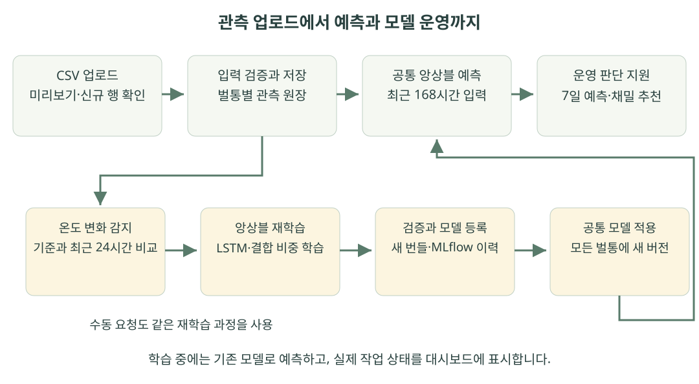

# BeeOPS 양봉 운영 서비스 기획서

**조별 프로젝트 기획서 · 독립 실행 최종본 · 2026년 10월 1일**

배포 폴더는 `BeeOPS_최종본`이다. 저장소를 내려받은 뒤 폴더 안에서 `docker compose up --build`로 실행한다. 기본 주소는 **http://localhost:8012**다. macOS 직접 실행은 `sh setup.sh` 후 `sh start.sh`를 사용한다. 관측 원장과 새 학습 결과는 이 폴더의 독립 저장소에 기록한다.

BeeOPS는 벌통의 무게·외기온 관측을 받아 향후 7일의 무게를 예측하고, 운영자가 검토할 채밀 후보 기간을 제시하는 양봉장용 의사결정 지원 서비스다. 관측 저장부터 예측, 환경 변화 감시, 실제 앙상블 재학습과 모델 적용까지 하나의 화면에서 연결한다. 이번 프로젝트는 공개 관측과 합성 실습 자료로 기능을 구현하고 검증한 로컬 MVP이며, 실제 양봉장에 상용 배포한 서비스는 아니다.

| 기획 요약 | 내용 |
|---|---|
| 핵심 사용자 | 여러 벌통을 관리하는 양봉가, 양봉장 운영 책임자, 모델 운영 담당자 |
| 해결할 문제 | 흩어진 관측 기록을 비교하고 채밀·점검 일정을 판단하는 데 필요한 근거를 모으기 어려움 |
| 주요 산출물 | 실제 관측 추이, 현재 모델의 과거 예측 비교, 향후 168시간 무게 예측, 최대 3일의 채밀 후보 기간 |
| 입력·모델 | 벌통별 최근 연속 168시간의 무게·외기온 → 공통 TiRex-2 + TensorFlow LSTM 앙상블 |
| 운영 기능 | CSV 미리보기·저장, 벌통별 원장, 온도 변화 감지, 수동·자동 재학습, MLflow 등록·공통 적용 |
| 기본 관측 사례 | 브라질 Apis 2, Vecauce 3, 브라질 무침벌 1 |
| 검증 범위 | 최종본의 백엔드 430개·UI 105개 통과, 실제 앙상블 학습·등록·적용 확인 |
| 후속 검증 | 센서 자동 연동, 현장 작업 기록, 사용자별 권한, 실제 운영자의 일정 판단과 업무 효과 |

## 1. 사업 문제와 이해관계자

### 1.1 운영자의 질문에서 시작한다

양봉장 운영자는 벌통의 현재 무게만으로 다음 방문이나 채밀 일정을 정하기 어렵다. 일정 기간의 증감, 최근 변화, 다른 벌통과의 차이, 향후 예상 흐름을 함께 확인해야 한다. 데이터가 파일과 개별 기록으로 나뉘면 비교에 시간이 들고, 갑작스러운 변화를 현장 작업의 결과인지 환경 변화인지 구분하기도 어렵다.

BeeOPS가 지원하는 질문은 **“최근 벌통 무게가 어떻게 변했으며, 앞으로 일주일 중 어느 기간을 우선 확인할 것인가”**다. 화면은 채밀을 자동 지시하지 않는다. 운영자가 예측과 관측을 검토한 뒤 현장에서 꿀의 숙성도·봉개·수분·비축 먹이를 확인하도록 판단 근거를 제공한다.

이 문제의 발생 빈도와 점검 비용은 아직 양봉가 인터뷰로 측정하지 않았다. 따라서 이번 기획의 고객 가치는 검증할 가설로 두고, 구현 성과는 데이터·모델·작업 흐름이 실제로 연결되는지로 평가한다.

### 1.2 사용자별 가치와 책임

| 이해관계자 | 필요한 판단 | BeeOPS가 제공하는 근거 | 사용자의 최종 책임 |
|---|---|---|---|
| 양봉가·현장 담당자 | 어떤 벌통을 언제 확인할지 | 관측 변화, 미래 무게 경로, 추천 날짜 | 현장 상태와 작업 가능 여부 확인 |
| 양봉장 운영 책임자 | 여러 벌통의 방문·채밀 일정을 어떻게 조정할지 | 동일 화면에서 벌통별 관측과 공통 모델 결과 비교 | 인력·장비·이동 일정 조정 |
| 모델 운영 담당자 | 새 데이터가 모델에 반영됐는지, 학습이 실제 진행 중인지 | 적용 버전, 결합 가중치, 실제 학습 회차, 등록·적용 결과 | 데이터·학습 오류 확인과 운영 대응 |
| 데이터·서비스 담당자 | 어떤 파일과 모델로 결과가 만들어졌는지 | 출처, 관측 스냅샷, 작업 ID, 모델 실행 기록 | 데이터 계약 관리와 결과 추적 |

사업화 방향은 양봉장 단위로 사용하는 B2B 운영 도구다. 우선 CSV를 보유한 양봉장과 소규모 파일럿을 진행하고, 기록 확인 시간과 판단 근거의 활용도를 확인한 뒤 센서 연동과 조직별 운영 기능을 확장한다. 이용료·시장 규모·매출 전망은 이번 구현에서 검증한 항목이 아니다.

## 2. 강의 도메인 매핑 · HAIC에서 BeeOPS로

강의의 예측 서빙, 버전 관리, 감시·재학습 구조를 양봉 운영에 맞춰 연결했다. 아래 표는 현재 제품의 계약이며, 과거 24시간 입력 LSTM 실습이나 정확도 임계값 기반 배포 게이트와 구분한다.

| HAIC의 여덟 항목 | 현재 BeeOPS의 대응 | 구현·판단 기준 |
|---|---|---|
| 1. 예측 대상: 다음날 종가 | 향후 7일의 시간별 벌통 무게(kg)와 채밀 후보 기간 | 168개 예측값을 생성하고 채밀 추천 기간을 계산 |
| 2. 입력: 최근 20거래일 close·volume | 최근 연속 168시간의 weight_kg·temperature_c | 벌통을 섞지 않고 완료된 시간 관측만 입력 |
| 3. 데이터 공급: 대시보드 CSV | CSV 미리보기 → 확인 후 저장 → 벌통 작업공간 등록 | 출처·시간·단위·중복·충돌 검증, 벌통별 원장 보존 |
| 4. 배포 게이트: RMSE 기준 | 학습 결과의 유한성, 저장 모델 재로드, 등록·적용 절차 확인 | 주 제품은 임의 MAE 목표로 예측·추천·새 번들 적용을 차단하지 않음 |
| 5. 드리프트: 변동성 급변 | 고정 온도 기준과 최근 24시간의 평균 차이 | 절댓값 4°C 이상, 표준화 차이 1.5 이상을 모두 만족하면 자동 재학습 요청 |
| 6. 재학습: 최신 데이터 fine-tuning | 실제 LSTM 추가 학습과 앙상블 결합 가중치 학습 | LSTM 학습·가중치 보정·최종 평가 목표 구간을 시간순 분리, TiRex-2는 유지 |
| 7. 알림: 운영 로그 | 공통 재학습 알림과 운영 화면의 작업 기록 | 실제 대기·학습·완료 회차 표시. 고온 실습 결과는 사용자가 확인할 때까지 유지 |
| 8. 이해관계자: 분석가·운영자 | 양봉가·양봉장 책임자·모델 운영자 | 현장 판단과 데이터·모델 운영 책임을 분리 |

온도 변화 감지는 모델 입력 분포가 달라졌다는 운영 신호다. 예측 오차 증가나 벌통 질병을 판정하는 신호로 바꾸어 설명하지 않는다. 정확도 평가는 결과를 이해하는 근거로 제공하며, 현장 판단은 관측과 추가 점검을 함께 사용한다.

## 3. 제품 경험과 핵심 사용자 흐름

### 3.1 벌통 선택부터 채밀 후보 검토까지

1. **벌통 선택:** 기본 공개 관측 3개 중 하나를 선택하거나 본인의 CSV로 추가한 작업공간을 연다. 벌통 이름으로 구분하며 날짜는 관측 범위와 차트 축에서 확인한다.
2. **관측 확인:** 실제 무게 기록의 상승·하락·반등을 살핀다. 같은 차트에서 현재 앙상블로 다시 계산한 과거 1시간 예측을 관측값과 비교한다.
3. **미래 확인:** 마지막 관측 이후 168시간의 무게 예측과 채밀 후보 기간을 확인한다. 모델과 예측 길이를 고르는 별도 선택 과정 없이 현재 적용 모델을 사용한다.
4. **현장 결정:** 추천 날짜를 작업 후보로 삼고, 꿀의 숙성도와 비축 먹이, 이동·인력 조건을 확인해 실제 작업 일정을 정한다.
5. **새 관측 반영:** 새 CSV를 저장하면 벌통의 관측 스냅샷이 바뀌고 해당 데이터로 예측을 다시 계산한다. 온도 변화와 학습 상태는 운영 화면에서 이어서 확인한다.


### 3.2 화면별 역할

| 화면 | 사용자가 확인하는 내용 | 완료되는 업무 |
|---|---|---|
| 대시보드 | 관측·과거 예측, 다음 1시간 값, 향후 7일 경로, 채밀 후보 기간 | 기록과 예측을 비교해 확인할 시점 정리 |
| 데이터 | CSV 미리보기, 신규·중복·충돌 행, 저장 결과, 원장·CSV 다운로드 | 데이터 상태를 확인하고 벌통별 관측 추가 |
| 사용 모델과 평가 | 현재 공통 모델의 구성·가중치·평가 출처 | 어떤 모델이 결과를 만들었는지 확인 |
| 운영과 작업 기록 | 온도 기준·변화, 앙상블 재학습, 작업 이력·로그 | 실제 진행과 실패 원인을 확인하고 재시도 판단 |

과거 예측 비교는 최대 48개의 목표 시점에 대해 현재 모델을 다시 실행한 결과다. 각 목표 직전의 연속 168시간을 입력으로 사용하므로 최소 169시간의 관측이 있어야 한 쌍을 비교할 수 있다. 이 값은 당시 미리 저장했던 예측의 운영 실적과 구분해 표시한다.

## 4. 데이터 구성과 입력 계약

### 4.1 기본 공개 관측 사례

기본 사례는 각각 독립적인 실제 관측 구간이다. 원본 무게를 보기 좋은 모양으로 변경하거나 다른 벌통을 이어 붙이지 않았으며, 시간별 완료 구간의 중앙값으로 가공했다. 현재 사례 목록과 파일 해시는 [관측 사례 manifest](../data/trend_cases/manifest.json)에서 확인할 수 있다.

| 화면 이름 | 공개 원자료 | 관측 기간·기록 시계 기준 | 시간 관측 수 |
|---|---|---|---:|
| 브라질 Apis 2 | UFC 양봉장 Apis mellifera 2번 | 2024-12-18 15:00 ~ 2025-01-12 23:00 | 609 |
| Vecauce 3 | 라트비아 Vecauce 3번 벌통 | 2021-07-13 00:00 ~ 2021-07-31 23:00 | 456 |
| 브라질 무침벌 1 | UFC 양봉장 무침벌 1번 | 2025-10-29 00:00 ~ 2025-11-17 20:00 | 477 |

브라질 자료는 [UFC Apiary / Zenodo](https://doi.org/10.5281/zenodo.20399470), 라트비아 자료는 [Vecauce / DataverseLV](https://doi.org/10.71782/DATA/J1CQTJ)의 공개 데이터이며 CC BY 4.0 출처와 가공 근거를 보존했다. Vecauce 자료는 내부·외부 온도와 벌통 총무게를 포함하지만, 현재 모델에는 무게와 외기온만 입력한다.

세 사례는 관측 변화가 드러나는 구간을 살펴 선택했다. 따라서 전체 양봉장을 대표하는 무작위 표본이나 독립적인 성능 시험 세트로 사용하지 않는다. 원본 시간대가 명시되지 않은 자료의 `+00:00`은 형식을 맞추기 위한 기록상 가정이며, 현지 시각을 UTC로 검증·변환했다는 의미가 아니다.

최종본을 처음 실행하면 위 3개 공개 사례가 등록된다. 고온 실습을 저장하면 `TEMP-DRIFT-PRACTICE` 작업공간이 추가된다. 이전 개발 서버의 사용자 원장이나 학습 작업 이력은 최종본의 초기 운영 상태로 가져오지 않는다.

### 4.2 무엇을 측정한 값인가

`weight_kg`는 측정된 벌통 무게다. 벌통·벌·먹이·수분 등 여러 요인이 반영될 수 있으므로 예측 무게를 수확 가능한 꿀의 양으로 표시하지 않는다. 원자료에 채밀·급이·취급 작업이 충분히 기록되지 않아 특정 하락을 자연 감소나 채밀로 확정할 수도 없다. 특히 서로 다른 지역과 벌 종류의 결과를 동일한 생물학적 기준으로 해석하지 않는다.

`event`는 관측 처리와 현장 기록을 위한 분류다. `normal`은 건강 진단 결과가 아니며, 수치 규칙으로 만든 `colony_alert`도 질병·분봉의 정답이 아니다. 이러한 한계는 추천을 이해하는 데 필요한 데이터 조건으로 관리한다.

### 4.3 업로드 계약

| 항목 | 현재 CSV 미리보기·저장 계약 |
|---|---|
| 파일 | UTF-8 또는 UTF-8 BOM, 최대 5 MiB·10,000행 |
| 열 | timestamp, hive_id, weight_kg, temperature_c, event의 정확히 5개 열. 열 순서는 무관 |
| 벌통 | 한 파일에 하나의 hive_id. 새로운 벌통은 별도 작업공간으로 등록 |
| 시각 | 시간대가 있는 정시 시각, 오름차순·중복 없음·정확히 1시간 간격 |
| 무게·외기온 | 유한한 값, 0 < 무게 ≤ 300 kg, −50 ≤ 외기온 ≤ 60°C |
| 사건 | normal, harvest, feeding, inspection, sensor_fault, colony_alert |
| 중복·충돌 | 같은 시각·값은 중복 처리. 값 충돌·일반 CSV의 과거 끼워넣기·시간 누락은 원장을 덮어쓰지 않고 안내 |
| 예측 준비 | 저장 가능한 파일과 별개로, 현재 제품 예측에는 최근 연속 168시간 관측이 필요 |

미리보기는 저장 승인 전 관측을 바꾸지 않는다. 신규·중복·오류를 확인한 후 사용자가 저장을 누르면 백그라운드 작업을 생성한다. 관측 저장 뒤 부가 분석이 실패한 경우에는 저장된 자료와 실패한 작업을 구분해 보여 준다. 무게·온도 범위는 소프트웨어 입력 계약이며 모든 장비의 생물학적 정상 범위를 뜻하지 않는다.

## 5. 예측과 채밀 후보 기간의 설계

### 5.1 한 모델을 공유하고 벌통별 입력을 바꾼다

제품은 `BeeOPS_Horizon_Weight`의 현재 TiRex-2 + LSTM 번들을 사용한다. 모든 벌통에 같은 모델 파일과 결합 가중치를 적용하고, 벌통을 선택하면 입력 관측만 바뀐다. CSV마다 새로운 제품 모델을 만드는 방식이 아니므로 운영자가 벌통별 모델 조합을 관리할 필요가 없다.

| 구성 | 역할 | 재학습 시 처리 |
|---|---|---|
| TiRex-2 | 과거 시계열 문맥으로 미래 무게 경로 추론 | 기존 체크포인트 유지 |
| TensorFlow LSTM | 무게·외기온 문맥을 입력받아 168시간의 무게 변화량 예측 | 현재 모델의 파라미터를 이어 학습 |
| 결합 가중치 | 두 모델의 실제 출력을 하나의 무게 경로로 결합 | 분리된 보정 구간으로 다시 선택 |

LSTM을 실제로 학습하고 추론하며 이름만 포함한 구성이 아니다. 각 구성 모델의 비중은 5~95% 범위로 유지한다. 현재 가중치는 적용 번들에서 읽어 표시하고, 새로운 데이터로 학습해도 선택 결과가 이전과 같을 수 있다. 모델 구조·전처리·가중치 계산·평가의 자세한 내용은 [모델 상세 설명](BeeOPS_모델_상세설명.md)에 정리한다.

### 5.2 채밀 후보는 예측 경로에서 계산한다

채밀 추천은 168시간 예측값을 24시간 구간별 중앙값으로 정리하고, 높은 무게가 예상되는 연속 구간을 고르는 규칙이다. 비슷한 수준의 구간이 길게 이어지면 24시간 중앙값이 가장 높은 구간을 포함하는 최대 3일로 좁힌다. 이는 마지막 관측 시각을 기준으로 한 기간이며, 현지 달력의 낮·밤 작업 시간을 자동으로 결정하는 기능은 아니다.

계속 상승하는 경로에서는 뒤쪽을, 감소하는 경로에서는 앞쪽을, 평탄한 경로에서는 비슷한 수준이 유지되는 구간을 후보로 제시한다. 실제 추천은 모델이 계산한 경로를 사용하며, 공개 사례의 모양에 맞춘 미리 정해진 날짜나 임의의 미래 값을 넣지 않는다.

주 제품은 평가 점수가 낮거나 현장 확인 정보가 비어 있다는 이유로 유효한 예측과 추천을 숨기지 않는다. 다만 관측 부족·모델 로드 실패·불완전한 예측 경로는 실제 오류로 표시한다. 추천 날짜는 꿀의 숙성도나 식량 여유를 확인한 결과가 아니므로 현장 점검과 결합해 사용한다.

## 6. 환경 변화 감시와 실제 앙상블 재학습

### 6.1 수동 요청과 온도 변화가 같은 학습 경로로 연결된다

운영자는 **앙상블 재학습** 버튼으로 현재 벌통의 관측을 사용한 학습을 요청할 수 있다. 온도 변화가 감지되면 같은 제품 파이프라인에 자동 요청을 넣는다. 두 경로 모두 실제 LSTM과 결합 가중치를 갱신하며, 별도 실습용 LSTM을 학습한 뒤 제품 모델을 바꿨다고 표시하지 않는다.

온도 감시는 처음 확보한 최근 연속 정상 168시간의 평균·표준편차를 기준으로 저장한다. 기준 이후 새로운 정상 관측이 24시간 이상 쌓이면 최신 24시간의 평균과 비교한다. 다음 조건을 동시에 만족하면 재학습을 요청한다.

```text
평균 차이 = |최근 24시간 평균 − 저장된 기준 평균|
평균 차이 ≥ 4°C
평균 차이 / max(기준 표준편차, 1°C) ≥ 1.5
```

임계값은 온도 변화에 따른 모델 운영 흐름을 검증하기 위한 프로젝트 설정이다. 일반 자동 감시의 기준은 비교할 때마다 이동하지 않으며 모델 적용 후 갱신한다. 같은 관측·기준의 자동 요청을 중복 실행하지 않는다.

**기본 고온 실습의 저장 버튼은 별도의 명시적 실행 요청이다.** 고온 미리보기는 고정된 정상 336행과 고온 168행을 함께 확인한다. 새 미리보기를 만들고 저장하면 이미 보관된 관측도 다시 사용해 실제 앙상블을 학습한다. 같은 미리보기의 저장 재시도는 같은 작업을 반환하고, 동일 실습이 실행 중이면 그 작업을 따라간다. 데이터 중복 저장과 사용자가 요청한 재학습 반복은 구분한다.

### 6.2 학습·등록·적용의 순서

| 단계 | 실제 처리 | 남기는 근거 |
|---|---|---|
| 관측 고정 | 작업 요청 시 벌통·관측 스냅샷을 고정 | 입력 자료, 출처, 작업 ID |
| 시간순 분리 | 정상 목표값을 LSTM 학습·가중치 보정·최종 평가로 나눔 | 각 구간 시작·종료 시각과 표본 수 |
| LSTM 학습 | 부모 LSTM·정규화 설정을 사용해 실제 8회 학습 | 완료 회차, 손실, 학습 전후 파라미터 해시 |
| 가중치 보정 | 보정 구간에서 두 모델의 출력을 비교해 결합 비중 선택 | 이전·새 가중치, 보정 오차 |
| 최종 평가 | 이후 별도 시점에서 이전·새 앙상블의 1시간 오차 계산 | 실제값·예측값·MAE |
| 등록·적용 | 저장 모델 재로드 확인, MLflow 등록, 새 불변 번들 게시 | run ID, 등록 버전, 제품 번들 버전 |
| 후속 운영 | 모든 벌통이 새 번들 사용, 온도 기준 갱신 | 적용 상태와 기록 저장 경고 |

수동 학습에도 입력 문맥 168시간과 아직 소비하지 않은 정상 목표값 24개 이상이 필요하다. 보정과 최종 평가에는 각각 6~24개 목표 시점을 남긴다. 목표값의 시간 구간은 겹치지 않지만, 시점별 입력은 그 시점 이전에 이미 관측한 이력을 사용할 수 있다. 이를 전체 데이터의 독립성이나 사전학습 자료 미포함을 보증하는 표현으로 확대하지 않는다.

### 6.3 작업 상태와 실패를 사실대로 보여 준다

접수 응답은 완료가 아니다. 화면은 서버가 보고한 대기·실행 상태와 실제 LSTM 완료 회차를 표시한다. LSTM이 8/8회 끝나도 결합 비중 학습과 예측 오차 확인이 진행 중이면 해당 단계를 계속 보여 준다. 벌통을 바꾸거나 학습 도중 화면을 다시 열어도 공통 작업을 확인할 수 있다.

고온 실습 저장이 접수되면 바로 `TEMP-DRIFT-PRACTICE`를 선택하고 대시보드를 연다. 실제 학습 작업이 생성되기 전에는 관측 저장·요청 준비 상태를 표시한다. 실제 재학습 ID가 연결된 뒤 서버의 대기·학습·완료 상태를 보여 주며, **빠르게 끝나도 결과는 확인 버튼을 누를 때까지 유지**한다. 화면 이동·새로고침 뒤에도 미확인 실습을 복원한다. 이후 사용자가 다른 벌통을 선택하면 완료 응답 때문에 다시 강제 전환하지 않는다.

일반 수동·자동 작업의 짧은 알림과 실습 결과 고정 표시는 수명이 다르다. 일반 알림은 약 15초 후 숨길 수 있지만 고온 실습 결과는 확인 전까지 유지한다. 과거 작업을 조회하거나 네트워크 오류가 발생했다고 새 학습을 만들거나 진행률을 꾸며 내지 않는다.

일반 수동·자동 경로에서 같은 스냅샷의 중복 요청은 기존 작업을 반환하고, 실패·중단된 요청은 기록을 보존한 채 운영자가 수동으로 재시도할 수 있다. 작업은 단일 큐에서 순서대로 실행한다. 모델 적용 전의 학습·등록·파일 오류는 실패로 남기고 기존 모델을 유지한다. 적용 후 부가 기록이나 온도 기준 저장만 실패한 경우에는 적용 완료를 유지하면서 경고를 별도로 남긴다. 서버 재시작 시 끝나지 않은 작업은 중단으로 정리한다.

## 7. 서비스 구조와 주요 API

### 7.1 구현 구조



| 구성 요소 | 책임 | 주요 구현 |
|---|---|---|
| 화면 | 벌통 선택, 관측·예측 차트, 업로드, 실제 작업 상태 | HTML·CSS·JavaScript |
| API·데이터 계약 | 입력 검증, 작업 요청, 조회 경계 | FastAPI·Pydantic |
| 원장·작업공간 | 벌통별 데이터 분리, 중복·충돌 처리, 작업 이력 | SQLite, WorkspaceManager |
| 예측 서비스 | 공통 번들 선택, 실제 구성 모델 추론, 결과 정합성 확인 | HorizonModelService·HorizonReports |
| 과거 비교·추천 | 목표 시각 정렬, 예측 경로 기반 후보 계산 | HorizonHistoryReports·채밀 추천 규칙 |
| 학습 운영 | 온도 기준, 작업 큐, 진행 회차, 가중치 보정·게시 | TemperatureDriftCoordinator |
| 모델 기록 | 실험·등록 버전·모델 파일·출처 보존 | MLflow와 불변 번들 폴더 |

TensorFlow와 TiRex 추론 환경을 분리해 같은 로컬 서비스에서 사용한다. 현재 구성은 단일 서버·단일 학습 워커를 기준으로 하며, 분산 처리나 무중단 다중 인스턴스 운영까지 구현한 상태는 아니다.

### 7.2 제품의 주요 API 계약

| API | 역할 |
|---|---|
| `GET /workspaces` | 기본 사례와 사용자가 등록한 벌통 작업공간 조회 |
| `POST /imports/preview` | CSV 계약·신규·중복·충돌 확인 |
| `POST /imports/commit` | 확인된 미리보기를 저장 작업으로 접수 |
| `GET /imports/jobs/{job_id}` | 관측 저장·분석 작업의 진행과 결과 조회 |
| `GET /observations`, `GET /data/rows`, `GET /data/export` | 벌통별 관측 조회·CSV 내보내기 |
| `GET /harvest/recommendation` | 현재 공통 모델의 168시간 예측과 채밀 후보 기간 |
| `GET /forecast/history` | 현재 모델의 과거 1시간 예측과 실제 관측 비교 |
| `GET /models/horizon` | 적용 모델·구성·결합 가중치·평가 기록 |
| `POST /models/retrain` | 선택 벌통의 관측으로 제품 앙상블 학습 접수 |
| `GET /monitoring/temperature`, `POST /monitoring/temperature/check` | 벌통별 온도 상태 조회·수동 비교 |
| `GET /monitoring/retraining` | 선택 벌통과 무관한 공통 재학습 상태 조회 |
| `GET /monitoring/retraining/jobs/{job_id}` | 최근 목록에서 빠진 작업까지 정확한 ID로 조회 |
| `POST /data/simulations/temperature/preview` | 서버가 검증한 기본 실습 파일로 미리보기 생성 |

벌통별 요청에는 `workspace_id`를 사용한다. 예측 결과에는 모델 버전·run ID와 관측 snapshot ID가 연결되어 있어, 화면 결과가 어떤 입력과 모델에서 나왔는지 확인할 수 있다. 조회만으로 새 관측이나 학습 작업을 만들지 않는다.

호환용 1시간 LSTM 레지스트리 `BeeOPS_Common_Weight`와 주 제품 레지스트리 `BeeOPS_Horizon_Weight`를 구분한다. 이전 배포 게이트 실습의 버전·판정은 이 최종본의 앙상블 정책이나 초기 작업 이력으로 설명하지 않는다. 주 재학습 버튼과 예측 화면의 대상은 `BeeOPS_Horizon_Weight`다.

## 8. 실행 검증과 성능 수치의 해석

### 8.1 소프트웨어 검증과 독립 실행 상태

독립 최종본에서 백엔드 회귀 **430개 통과·1개 생략**, Node VM 기반 UI 회귀 **105개 통과**를 확인했다. 생략 항목은 별도 설정이 필요한 Chronos 실제 연동 검사이며, 기존 Pydantic 사용 중단 예고 경고 4건이 남아 있다. 이는 데이터 계약·작업 상태·등록·오류 처리의 검증 수이며 양봉 업무 효과나 예측 정확도의 수치가 아니다. 최종본 검증 로그를 [백엔드 결과](evidence/backend_package_regression.log)와 [UI 결과](evidence/ui_package_regression.log)에 보존했다. 독립 폴더를 처음 실행할 때의 절차는 [시연 가이드](시연가이드.md)를 따른다.

고온 실습 UI 검사는 즉시 벌통 선택, 저장 전 준비 상태, 실제 작업 ID 연결, 빠른 완료 유지, 새로고침 복원, 재실행, 확인 버튼, 실패 후 임시 선택 정리를 포함한다. 실제 학습은 LSTM 파라미터 변화, 고정 TiRex 체크포인트, 별도 결합 비율 학습, 모델 재로드·등록·공통 적용으로 확인한다.

### 8.2 포함된 모델의 실제 평가와 해석

최종본의 초기 모델 스냅샷은 **번들 9, LSTM 45% + TiRex-2 55%**다. `run_id`는 `d3a7d6beca674cab8037bb9f51f99c78`다. 이후 사용자가 재학습하면 새 번들이 적용되므로 실행 중 상태는 모델 화면과 `GET /models/horizon`으로 확인한다.

| 포함 번들의 최근 학습 기록 | 값 |
|---|---|
| 실행 방식 | 고정 합성 고온 관측을 다시 사용한 명시적 실습 |
| LSTM 학습 / 결합 비율 보정 / 최종 평가 | 120개 입력 창·8회 / 24개 시점 / 24개 시점 |
| 이전 → 새 LSTM 결합 비중 | 55% → 45% |
| 같은 24개 시점의 1시간 MAE | 0.00244045 → 0.00235271 kg |
| TiRex-2 체크포인트 | 변경하지 않음 |

이 수치는 [포함 모델의 평가 파일](../data/horizon_models/9/evaluation.json)에 저장된 **반복 합성 실습의 설명용 결과**다. 시점별 학습·보정·평가는 나누지만 이미 사용한 고정 자료를 재사용하므로 독립적인 새 미래 시험이나 현장 정확도 개선으로 해석하지 않는다. 새 실행의 수치·선택 비율·소요 시간은 같다고 보장하지 않는다.

### 8.3 과거 비교와 현재 모델을 구분한다

모델 상세 문서에는 초기 번들 2의 1·24·72·168시간 끝점 벤치마크를 비교 근거로 남겼다. 이 기록은 현재 번들 9의 장기 예측 성능을 다시 측정한 결과가 아니다. 현재 포함 모델은 반복 실습의 이력을 가진 시작점이며, 원래 개발 서버의 과거 작업·관측 원장은 이 독립 폴더의 새 운영 이력과 분리한다.

## 9. 구현 범위와 후속 과제

| 영역 | 현재 구현 | 실제 서비스 전 필요한 확장 |
|---|---|---|
| 데이터 수집 | 공개 CSV·사용자 CSV, 벌통별 관측 원장 | 센서·게이트웨이 연동, 단위·교정·배터리 상태 수집 |
| 현장 판단 | 무게 예측과 채밀 후보 기간, 현장 확인 안내 | 실제 채밀·급이·점검 기록, 숙성도·수분 정보와 대조 |
| 모델 운영 | 수동·온도 재학습, 이력·MLflow, 실패 처리 | 지역·계절·벌 종류별 외부 검증, 장기 예측의 불확실성 평가 |
| 사용자 운영 | 로컬 대시보드와 API | 인증, 조직·양봉장별 권한, 데이터 접근 통제 |
| 알림 | 화면의 공통 작업 알림·로그 | 웹훅·메신저·모바일 푸시, 알림 수신 정책 |
| 서비스 기반 | 단일 프로세스와 로컬 저장소 | 백업·복구 검증, 분산 큐, 모니터링·가용성 목표 |

후속 작업은 기능 수를 늘리기보다 근거를 확보하는 순서로 진행한다. 먼저 작업 이력이 포함된 새 양봉장 데이터를 확보하고, 기존 CSV 흐름으로 운영자와 함께 사용한다. 다음으로 센서 자동 수집과 권한 관리를 붙인다. 이후 지역·계절이 다른 데이터를 별도 평가해 모델 적용 범위와 운영 목표를 정한다.

## 10. 기대 효과와 파일럿 평가 계획

기대 효과는 기록 확인과 일정 검토 시간을 줄이고, 추천 근거와 모델 변경을 추적하기 쉽게 만드는 것이다. 생산량 증가나 비용 절감은 아직 측정하지 않았으며 다음 지표를 파일럿에서 확인한다.

| 제안 KPI | 측정 방법 | 목표 설정 방식 |
|---|---|---|
| 사례 확인 소요 시간 | 같은 관측 사례를 기존 파일과 BeeOPS로 검토한 시간 비교 | 기존 업무의 중앙값 측정 후 단축 목표 협의 |
| 판단 근거 확인율 | 추천 시점·관측 기간·사용 모델을 정확히 설명한 사용자 비율 | 첫 사용자 평가를 기준으로 개선 목표 설정 |
| 업로드 완료율 | 유효 파일의 미리보기부터 저장 완료까지의 성공 비율과 이탈 원인 | 파일 오류와 서비스 오류를 분리해 관리 |
| 알림 이해도 | 대기·학습·완료·실패를 사용자가 올바르게 구분하는지 확인 | 작업 오인 사례를 줄이는 방향으로 개선 |
| 예측 평가 | 새 현장 자료의 동일 목표 시점에서 기준선·기존·새 모델 MAE 비교 | 벌통·예측 길이·표본 수를 함께 보고 |
| 현장 활용도 | 추천 기간을 실제 점검·채밀 계획에 참고한 사례와 변경 사유 기록 | 업무 적합성을 확인한 뒤 사업화 여부 판단 |

KPI 표는 향후 평가 계획이며 이미 달성한 성과나 서비스 수준 약속이 아니다. 현장 작업 결과와 데이터 품질을 함께 기록해야 예측의 유용성과 실제 생산·비용 효과를 구분할 수 있다.

## 11. 팀 역할과 발표 시연

### 11.1 역할 분담안

산출물별 책임을 다음과 같이 배분한다. 팀 규모에 따라 역할을 겸임한다.

| 역할 | 주요 책임 | 확인할 산출물 |
|---|---|---|
| 서비스·도메인 | 사용자 문제, 의사결정 흐름, 현장 확인 항목 | 기획서·사용자 시나리오·파일럿 지표 |
| 데이터·모델 | 원자료 출처, 전처리, 앙상블·평가 구간 | CSV manifest·모델 상세 문서·평가 결과 |
| 백엔드·MLOps | API·원장·학습 큐·등록·적용·오류 처리 | 실행 코드·회귀 검사·모델 추적 기록 |
| 화면·검증 | 대시보드·업로드·알림·모바일 사용성 | UI 검사·실제 브라우저 증거·발표 시연 |

### 11.2 발표 흐름

| 순서 | 보여 줄 장면 | 전달할 핵심 |
|---|---|---|
| 1 | 브라질 Apis 2의 관측·예측·후보 기간 | “관측을 보고 앞으로 확인할 날짜를 정리한다.” |
| 2 | Vecauce 3와 브라질 무침벌 1로 전환 | 같은 모델을 사용해도 벌통별 관측에 따라 결과가 달라짐 |
| 3 | CSV 미리보기와 신규·중복 확인 | 저장 전 데이터 계약을 확인하고 벌통별 원장을 보존 |
| 4 | 고온 실습 새 미리보기 → 저장하고 재학습 | 즉시 TEMP 벌통과 대시보드 전환, 실제 준비·대기·학습 단계 확인 |
| 5 | 모델 적용과 새 예측 확인 | 실제 파라미터 변화, MLflow 등록, 공통 모델 전환을 연결 |
| 6 | 고온 실습을 새 미리보기로 다시 실행 | 동일 관측은 보존하고 새 요청은 실제로 다시 학습. 같은 요청의 재시도는 중복 실행하지 않음 |
| 7 | 완료 후 화면 이동·새로고침 → 확인 버튼 | 결과는 확인 전까지 유지하며, 확인 뒤에는 과거 알림을 다시 재생하지 않음 |

실제 학습은 장비와 데이터에 따라 시간이 걸리므로 발표에서 짧은 시간을 보장하지 않는다. 실시간 진행 화면과 이미 저장된 검증 결과를 구분해 사용한다. 발표용 작업은 분리 환경에서 수행하고 기존 공개 관측·사용자 업로드·모델 증거를 초기화하지 않는다.

## 부록. 구현 근거와 검증 자료

현재 설명의 근거는 이 폴더에 포함된 코드·모델·출처 파일이다. 개발 서버의 과거 폴더를 실행 경로로 요구하지 않는다.

| 구분 | 근거 |
|---|---|
| 사용·실습 안내 | [README](../README.md), [6분 시연 가이드](시연가이드.md), [온도 드리프트 실습](온도_드리프트_실습.md) |
| 모델 설명 | [BeeOPS 모델 상세 설명](BeeOPS_모델_상세설명.md) |
| 공개 관측·가공 | [사례 목록·출처·파일 해시](../data/trend_cases/manifest.json) |
| API·원장·작업공간 | [API](../app/main.py), [기본 사례](../app/dashboard_data.py), [CSV 처리](../app/imports.py), [원장](../app/store.py) |
| 모델·예측·추천 | [공통 모델](../app/horizon_models.py), [예측 보고서](../app/horizon_service.py), [과거 비교](../app/horizon_history.py), [채밀 규칙](../app/harvest.py) |
| 실제 재학습과 알림 | [학습·감시·배포](../app/temperature_drift.py), [실습 자료 검증](../app/temperature_practice.py), [화면 상태](../app/static/app.js) |
| 포함 모델 근거 | [인덱스](../data/horizon_models/index.json), [9번 manifest](../data/horizon_models/9/manifest.json), [평가](../data/horizon_models/9/evaluation.json), [결합 보정](../data/horizon_models/9/ensemble_calibration.json) |
| 최종본의 회귀 결과 | [백엔드 430개 통과](evidence/backend_package_regression.log), [UI 105개 통과](evidence/ui_package_regression.log) |
| 공개 원자료·라이선스 | [UFC Apiary, CC BY 4.0](https://doi.org/10.5281/zenodo.20399470), [Vecauce, CC BY 4.0](https://doi.org/10.71782/DATA/J1CQTJ) |

이전 LSTM·Chronos 비교와 별도 품질 게이트 실습을 현재 제품의 앙상블 정책이나 검증 수치로 혼용하지 않는다.
